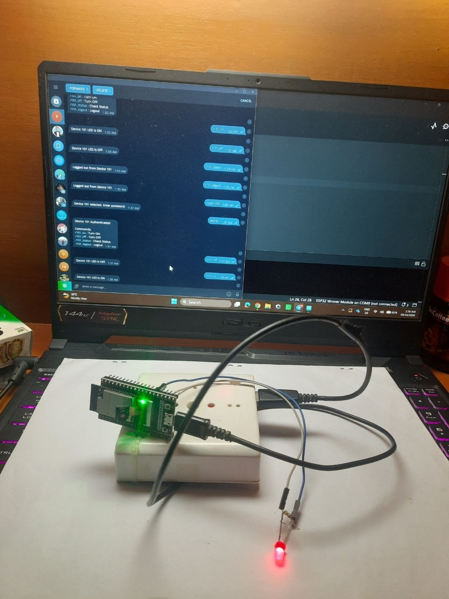
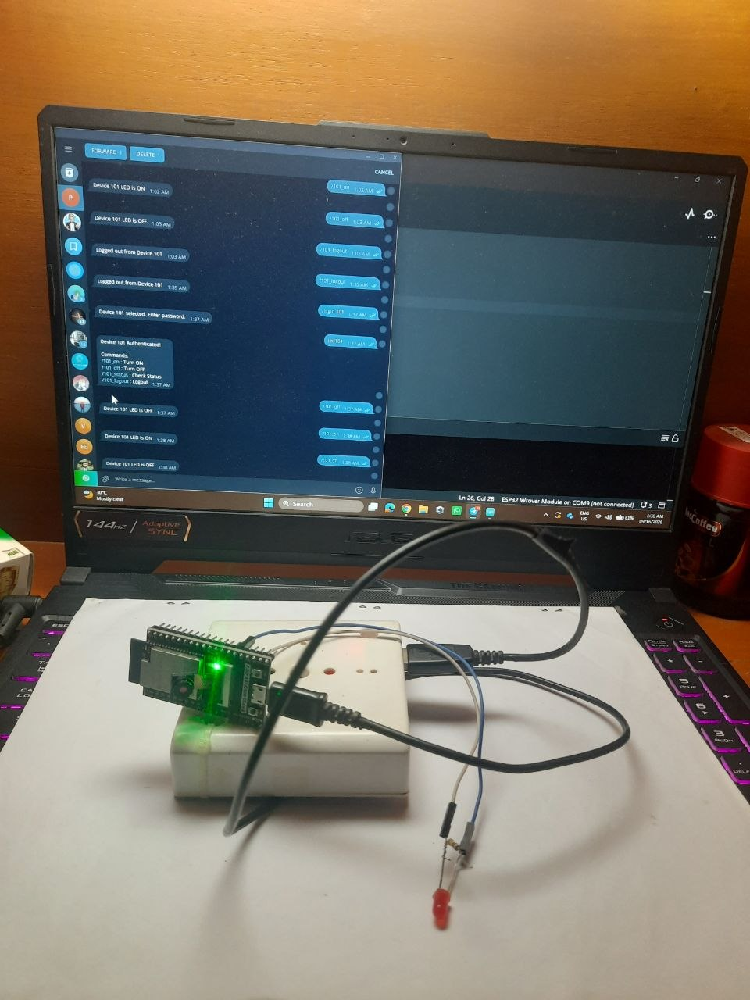
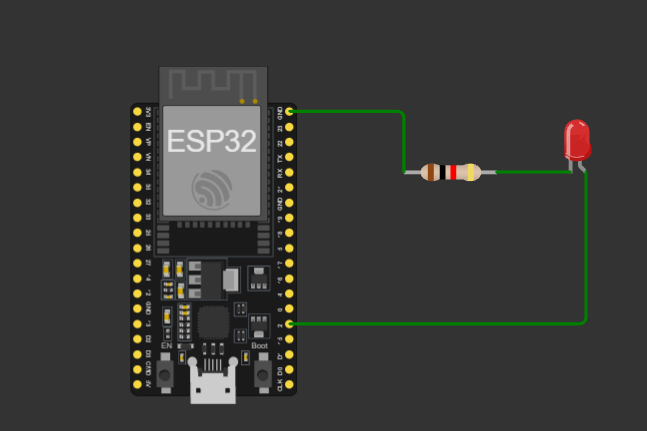

# ESP32 Multi-User Telegram Bot Controller

An IoT remote-control system powered by the ESP32 and Telegram Bot API. This project allows multi-user session-based control of GPIO pins across different networks without requiring port forwarding or static IP addresses.

## Features
- **Dynamic Authentication:** Device ID and password verification for multi-user access without hardcoding user Telegram IDs.
- **NAT Traversal:** Works over cellular data or external networks via HTTPS long-polling.
- **Session Management:** Tracks authenticated users dynamically with active session and logout functionality.
- **Hardware Control:** Remotely toggles GPIO outputs and queries live pin states.
- **LED ON**  
- **LED OFF** 
- **VIDEO**  <video src="https://github.com/user-attachments/assets/91316424-a047-46a2-8418-cf921bb81895" width="600" controls></video>


  
## Circuit Schematic
- **Board:** ESP32 Development Board
- **Output:** LED connected to GPIO 2 (built-in LED) via a 220Ω resistor to GND.
- **Circuit Diagram** 
  
## Hardware & Software Requirements
- ESP32 Development Board
- Arduino IDE with ESP32 Board Support installed
- `UniversalTelegramBot` Library (by Brian Lough)
- `ArduinoJson` Library (by Benoit Blanchon)

## Setup Instructions
1. Clone this repository:
   ```bash
   git clone [https://github.com/ijaj7076/LED_and_Telegram_BOT](https://github.com/ijaj7076/LED_and_Telegram_BOT)
